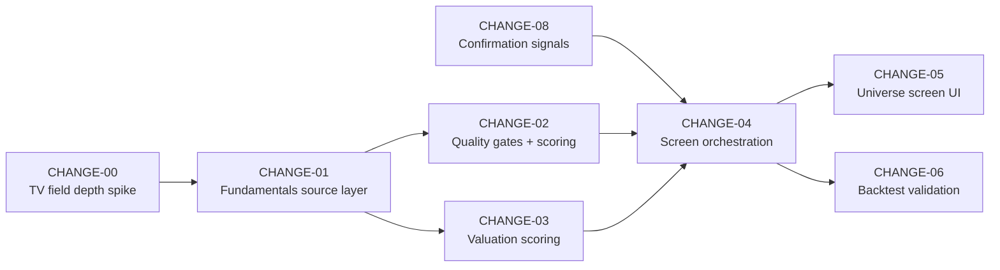

# TODO — Opportunity Screener Requirements (OpenSpec)

Derived from [`docs/oportunity.md`](./oportunity.md). Each section below is a **proposed OpenSpec
change** to be created under `openspec/changes/<slug>/` following the house structure
(`proposal.md`, `design.md`, `tasks.md`, `verify.md`), matching the precedent set by
`openspec/changes/universe/`.

Nothing here is implemented. This document defines scope boundaries and acceptance criteria so
each change can be proposed, specced, and applied independently.

## Preconditions

- `openspec/config.yaml` declares `strict_tdd: true` → every change below is **test-first**. No implementation without a failing test.
- Test runners available: `pytest`, `npm run test -w backend` (mocha), `npm run test -w frontend` (vitest), `python3 run_tests.py`.
- [Rule #2](../AGENTS.md): no inline financial computation — every formula lands in a versioned `py_services/` script.
- [Rule #4](../AGENTS.md): new dependencies go through `requirements.in` → `pip-compile requirements.in -o requirements.txt`. No manual `pip install`.
- [Rule #21](../AGENTS.md): `domain_model.sqlite` is the sole source of truth. New persistence requires a schema decision, never ad-hoc SQL.
- [Rule #15](../AGENTS.md): worktree-first for every change below.

## Blocking decisions

The six open decisions in [`docs/oportunity.md` §8](./oportunity.md) must be answered before
CHANGE-02 is proposed. CHANGE-00 and CHANGE-01 can proceed without them.

## Dependency graph

CHANGE-08 has no dependency on CHANGE-01 and can be built in parallel from the start.

## Design correction applied in revision 2

The original scoping treated all eleven source criteria as sequential hard gates. Per **F23** in
[`docs/oportunity.md`](./oportunity.md), that is now **three hard gates plus a weighted score across
four axes**. The instruction driving the change: make the screen less strict and genuinely aimed at
quality undervalued businesses rather than a filter that returns nothing.

The three non-negotiable gates:

1. **Sector eligible** — the ratios are undefined for banks, insurers, REITs, utilities
2. **Returns not manufactured by leverage** — Buffett tenet 7 and Smith criterion 3 converge here
3. **Cash is real** — FCF / Net Income not chronically broken; Buffett tenet 8 and Smith's cash conversion converge here

Everything else is scored on four axes: **Quality, Growth, Valuation, Confirmation**. Terminal
states gain a fourth band, `VALUE_TRAP_RISK`, for cheap candidates whose quality is unproven.

---

## CHANGE-00 — `tv-field-depth-spike`

**Type:** Spike / research. Time-boxed. Produces a report, not production code.

### Intent

Factor **F2** states that TradingView's `*_h` historical slice fields (`free_cash_flow_ttm_h`,
`total_revenue_fq_h`, `earnings_fq_h`) have undocumented depth. Criterion A4 (ten-year
consistency) and factor F13 (multi-year cash ROCE) both depend on whether these fields deliver
usable history. **No downstream change should assume an answer.**

### In Scope

- Throwaway probe script under `temp/` ([pitfall #16](../AGENTS.md) — never `/tmp/`) querying `*_h` fields for a sample of 10–15 tickers spanning US, TSX, and one European listing
- Measure: number of periods returned, period spacing (annual vs quarterly), presence of nulls, behavior for recently listed companies
- Confirm whether `return_on_capital_employed_fy` / `return_on_invested_capital_fy` can be requested for prior fiscal years or only the latest
- Document observed rate-limit behavior and response latency

### Out of Scope

- Any persistence, any production code path, any dependency added to `requirements.in`

### Acceptance

- [ ] Written finding recorded in `docs/architecture/` stating, per field, the observed depth and reliability
- [ ] Explicit verdict: **does TradingView satisfy A4, yes or no**
- [ ] If no, the finding names which substitute chain (F12 + F10) becomes mandatory rather than optional

### Review workload forecast

| Field | Value |
|---|---|
| Estimated changed lines | < 150 (throwaway) |
| Chained PRs recommended | No |
| Decision needed before apply | No |

---

## CHANGE-01 — `fundamentals-source-layer`

**Depends on:** CHANGE-00

### Intent

Factors **F1, F2, F3, F5, F6, F21**. Today three fundamentals sources exist with no precedence
rule and no provenance record. `standardize_metrics.py` exists specifically to prevent
"split-brain math"; adding TradingView as a third source without a resolution layer defeats it.

### In Scope

- New `py_services/fundamentals_resolver.py`: single entry point returning a normalized fundamentals record for a ticker
- Declared precedence chain: EDGAR (`edgar_facts.py`) → TradingView → yfinance (`fetch_financials.py`)
- **Per-field provenance**: every returned value carries `{value, source, as_of, is_point_in_time, definition_id}`
- New `py_services/tradingview_fundamentals.py`: thin client over `tradingview-screener`, reusing the `_throttled_get()` + `cache_get`/`cache_set` pattern already proven in `edgar_facts.py`
- Add `tradingview-screener` to `requirements.in`, recompile
- FX normalization policy per **F5**, inferring rates from TradingView native values only ([rule #27](../AGENTS.md) — no external FX APIs)
- Unauthenticated access only. Fundamentals update quarterly; the 900-second delayed feed is sufficient and this avoids the session-cookie question entirely (**F6**)

### Out of Scope

- Any scoring, gating, or ranking logic
- Schema changes to `domain_model.sqlite`
- Replacing existing `fetch_financials.py` callers (additive layer; migration is a later change)

### Acceptance

- [ ] Given a US ticker with a CIK, EDGAR values win and are marked `is_point_in_time: true`
- [ ] Given a TSX ticker, TradingView values are returned and marked `is_point_in_time: false`
- [ ] Given a ticker absent from both, yfinance fallback is returned with correct provenance
- [ ] Every field in the returned record carries non-null `source` and `as_of`
- [ ] Rate limiting verified: N sequential calls do not exceed the documented throttle
- [ ] Cache hit on a second identical call within the TTL window
- [ ] Multi-currency ticker returns both native and normalized values with the inferred rate recorded

### Test requirements (strict TDD)

- `investment_screener/backend/tests/py_services/test_fundamentals_resolver.py` — precedence, provenance, fallback chain, all written before implementation
- Network calls stubbed at the client boundary. **Not** stubbed on the resolution logic itself — [rule #1](../AGENTS.md) forbids mocking on critical runtime paths

### Review workload forecast

| Field | Value |
|---|---|
| Estimated changed lines | 400–550 |
| 400-line budget risk | Medium-high |
| Chained PRs recommended | Yes — split client from resolver if it exceeds budget |
| Decision needed before apply | **Yes** — F1 precedence and raw-inputs-vs-precomputed-ratios must be confirmed |

---

## CHANGE-02 — `quality-gate-engine`

**Depends on:** CHANGE-01. **Blocked by** open decisions §5.5, F4, F9 and F23.

### Intent

Factors **F4, F9, F10, F11, F12, F13, F16, F23, F27, F28**. Implements the **three hard gates**
plus the **Quality and Growth scoring axes**. Resolves the A4 blocker through the substitute chain
rather than waiting for ten years of data.

**Revised from revision 1:** this is no longer an all-pass/fail gate. Only sector eligibility,
leverage-free returns and cash reality are binary. Consistency, margins, reinvestment and growth
become scored contributions.

### In Scope

- New `py_services/quality_gate.py` exposing two distinct outputs: **hard gate result** (`ELIGIBLE` / `NOT_APPLICABLE` / `DISCARD`) and **scored axes** (Quality, Growth), each with per-criterion evidence
- **F9** — sector eligibility runs first. Banks, insurers, REITs and utilities short-circuit to `NOT_APPLICABLE` before any ratio is computed. Reuses or extends `sector_overrides.py`
- **F23 gate 2** — returns not manufactured by leverage. Net debt sanity plus unlevered return check (Buffett tenet 7 / Smith criterion 3)
- **F23 gate 3** — cash reality. FCF / Net Income not chronically broken across the available window
- **F4** — one canonical ROCE/ROIC definition, chosen by the open decision, encoded once and documented in the module header
- **F12** — surface the existing Piotroski F-Score from `fetch_financials.py` as the primary A4 substitute, **scored not gated**. Read the existing implementation; do not reimplement it
- **F10 + F28** — dispersion metrics (standard deviation of revenue growth, EPS growth and margins) from the `hist_*` arrays already produced. F28 specifically measures whether gross margin **holds or expands through a downturn**, the observable fingerprint of pricing power
- **F13** — cash-based ROCE alongside the accrual figure; divergence lowers the Quality score rather than failing the candidate
- **F16** — `owner_earnings()` = `net income + D&A − capex − additional working capital`, using D&A as the maintenance-capex proxy with the approximation documented. A3 shortfalls re-test against owner earnings before penalizing
- **F27** — one-dollar principle: cumulative retained earnings versus change in market capitalization over the same multi-year window
- **A4 strict path** where EDGAR provides ten years; substitute path elsewhere; the record states which path ran

### Out of Scope

- Valuation criteria (Block C) — CHANGE-03
- Persistence and orchestration — CHANGE-04
- Any UI

### Acceptance

- [ ] A bank ticker returns `NOT_APPLICABLE` without computing ROIC
- [ ] **Only the three declared gates can produce `DISCARD`.** A candidate weak on consistency or growth is scored down, not discarded (**F23**)
- [ ] A US ticker with ten years of EDGAR data runs the strict A4 test and records `path: strict`
- [ ] A TSX ticker runs the Piotroski + dispersion substitute and records `path: substitute`
- [ ] A ticker short on FCF growth but strong on owner earnings scores accordingly, with the retest noted
- [ ] Missing data returns `NOT_EVALUABLE`, **never** `PASS` (**F18**)
- [ ] Quality and Growth axes are returned **separately**, never pre-collapsed into one number (**F11**)
- [ ] Piotroski values match those already produced by `fetch_financials.py` for the same ticker
- [ ] One-dollar principle returns `NOT_EVALUABLE` when the window is too short rather than a misleading value

### Test requirements (strict TDD)

- `tests/py_services/test_quality_gate.py` with fixtures covering: excluded sector, strict path, substitute path, owner-earnings retest, missing-data path
- Golden fixtures for at least one real ticker per branch
- Assert explicitly that `NOT_EVALUABLE` never coerces to `PASS`

### Review workload forecast

| Field | Value |
|---|---|
| Estimated changed lines | 700–900 |
| 400-line budget risk | **High** |
| Chained PRs recommended | **Yes** — suggested split: (a) three hard gates + canonical ROIC, (b) A4 substitute chain (F12 + F10 + F28), (c) owner earnings + one-dollar principle (F16 + F27) |
| Decision needed before apply | **Yes** — §5.5 portfolio tension, F4, F9, F23 weights |

---

## CHANGE-03 — `valuation-rank-engine`

**Depends on:** CHANGE-01

### Intent

Factors **F7, F8, F11, F14, F15, F18, F23**. Implements Block C as a **percentile ranking**, never a
threshold gate. Greenblatt ranks; he does not threshold. Ranking is robust to the definitional
disagreement F4 cannot fully eliminate.

Adds the Buffett valuation leg absent from revision 1: **DCF on owner earnings with an explicit
margin of safety** (tenets 11–12). Buffett rejected P/E and P/B as primary criteria in 1992, so
neither may drive the valuation axis.

### In Scope

- New `py_services/valuation_rank.py` producing percentile ranks, not booleans
- **C1** — FCF yield on enterprise value. First verify whether `framework_score.fcfYield` is EV-based or market-cap-based; correct or wrap accordingly (open decision C1)
- **C2** — PEG, using TradingView's `price_earnings_growth_ttm` cross-checked against a locally computed value; divergence beyond a tolerance flags the record
- **C3 via F14** — sector-relative EV/EBIT discount against the cohort median, extending `peer_bench.py`. Cohort pulled from TradingView in a single query
- **C3 via F15** — Acquirer's Multiple: EV / operating earnings constructed **top-down from the income statement**, not from reported EBIT, per Carlisle's standardization rationale
- **F8** — sector- and cycle-adjusted acceptance bands, consuming `market_regime.py` / `macro_regime.py`, following Burry's stated practice of varying the acceptable multiple by industry and cycle position
- **F18** — self-historical C3 is explicitly reported as `NOT_EVALUABLE`; it is never silently approximated
- **Buffett tenets 11–12** — margin of safety as the gap between price and DCF-derived intrinsic value, computed on **owner earnings** (from CHANGE-02) rather than FCF. Reuses `dcf_scenarios.py`. Discount rate is the risk-free rate or a ~10% opportunity cost, configurable
- Reference point for the FCF-yield leg: Fundsmith's published portfolio weighted average of **3.7% against 2.8% for the S&P 500** — a comparative benchmark, not a threshold

### Out of Scope

- **F17 snapshot accumulation. Deferred** — Alpha Architect's finding is that relative-to-own-history value does not outperform absolute value, so the accumulation cost is not currently justified
- Quality criteria — CHANGE-02

### Acceptance

- [ ] Output is percentile ranks within the evaluated cohort, not pass/fail
- [ ] Sector-relative discount computed against a cohort of at least N peers; below N the result is `NOT_EVALUABLE`
- [ ] Acquirer's Multiple built top-down and documented as differing from reported EBIT
- [ ] Cycle adjustment measurably shifts the band when the regime input changes
- [ ] Self-historical C3 always reports `NOT_EVALUABLE` with the reason recorded
- [ ] PEG divergence between the TradingView value and the local computation raises a flag rather than picking one silently

### Test requirements (strict TDD)

- `tests/py_services/test_valuation_rank.py` — ranking behavior, thin-cohort handling, cycle-band shift, PEG divergence flag
- Regression test asserting the FCF yield denominator is enterprise value

### Review workload forecast

| Field | Value |
|---|---|
| Estimated changed lines | 450–600 |
| 400-line budget risk | Medium-high |
| Chained PRs recommended | Yes — split F14/F15 valuation metrics from F8 cycle banding |
| Decision needed before apply | **Yes** — F7 (rank vs threshold) and the C1 denominator verification |

---

## CHANGE-04 — `universe-screen-orchestration`

**Depends on:** CHANGE-02, CHANGE-03

### Intent

Factors **F11, F18, F19, F21, F22**. Wires the gate and the rank into a single run over the
Candidate Universe, and persists results including rejections. Completes the phase that
`openspec/changes/universe/proposal.md` explicitly deferred: *"AI/automated analysis over the
universe group (future phase — this delivers data foundation only)."*

### In Scope

- New `py_services/screen_universe.py` orchestrating: resolve → sector filter → quality gate → valuation rank → classify
- **Four terminal states plus `NOT_APPLICABLE`** (F23): `PRIORITY_BUY` (quality and undervalued), `WATCHLIST` (quality, fully valued), **`VALUE_TRAP_RISK`** (cheap, quality unproven — flagged for manual review rather than silently discarded), and `DISCARD`
- **Weighted composite across four axes** — Quality, Growth, Valuation, Confirmation. Quality and Valuation dominate; Confirmation is capped (F26) so it can never move a candidate across a band on its own
- Weights live in configuration, not in code, so they can be tuned against backtest results without a code change
- Schema decision for persisting screen results in `domain_model.sqlite` ([rule #21](../AGENTS.md)) — per-run results with timestamp, per-criterion outcome, provenance, and path taken
- **F22** — rejection reasons persisted, not discarded. Why a candidate failed is calibration data
- **F19** — declared structural bias emitted with every run: anti-momentum, anti-turnaround, penalizes growth capex
- Express route exposing the latest screen result for the universe

### Out of Scope

- UI rendering — CHANGE-05
- Automatic scheduling. No scheduler exists anywhere in the repository today; introducing one is a separate decision
- Any trade action. [Rule #17](../AGENTS.md) — output is advisory only

### Acceptance

- [ ] A full run over the universe produces one record per candidate with a terminal state
- [ ] Rejected candidates persist with their failing criterion and the evidence used
- [ ] Re-running does not overwrite history; results are append-only per run
- [ ] Non-evaluable criteria never contribute to a `PRIORITY_BUY` classification
- [ ] **Confirmation signals alone cannot change a band** — verifiable by removing them from a fixture run and asserting the band is unchanged (**F26**)
- [ ] `VALUE_TRAP_RISK` is reachable and distinguishable from `DISCARD`
- [ ] Weight changes in configuration alter classification without touching code
- [ ] Every result is traceable to source and vintage per criterion (**F21**)
- [ ] Run output is consumable by `backtest_harness.py`

### Test requirements (strict TDD)

- `tests/py_services/test_screen_universe.py` — end-to-end over a fixture universe covering all four terminal states
- `tests/api/` coverage for the new route
- Idempotency test: two runs against identical inputs produce identical classifications

### Review workload forecast

| Field | Value |
|---|---|
| Estimated changed lines | 500–650 |
| 400-line budget risk | High |
| Chained PRs recommended | **Yes** — split persistence schema from orchestration logic |
| Decision needed before apply | Yes — schema shape |

---

## CHANGE-05 — `universe-screen-ui`

**Depends on:** CHANGE-04

### Intent

Factors **F18, F19, F20, F21**. Surfaces screen results in `UniversePage.tsx`, converting the
Candidate Universe from a passive list into a ranked funnel — the gap identified in
[`docs/modules.md`](./modules.md).

### In Scope

- Per-candidate state badge: `PRIORITY_BUY` / `WATCHLIST` / `DISCARD` / `NOT_APPLICABLE`
- Expandable per-criterion breakdown showing `PASS` / `FAIL` / `NOT_EVALUABLE` with source and vintage per row, following the `PriceSourceBadge.tsx` precedent (**F21**)
- **F18** — non-evaluable criteria render visually distinct from passing ones. Never green
- **F19** — the declared bias is visible in the UI, not buried in documentation
- **F20** — a "send to Advisor" action. The screen is an input to the Portfolio Advisor, never a verdict. Copy must not present the checklist as due diligence
- Sort and filter by state and by valuation rank

### Out of Scope

- Triggering a screen run from the UI (that is a scheduler/trigger decision, deferred)
- Any change to `ScreenerTable.tsx` (60 KB) or `PortfolioTable.tsx` (41 KB) — see CHANGE-07

### Acceptance

- [ ] A candidate with any `NOT_EVALUABLE` criterion cannot display as a fully-passing checklist
- [ ] Every criterion row shows its source and data vintage
- [ ] Structural bias notice is present and not dismissible on first view
- [ ] "Send to Advisor" produces a candidate reference, not a recommendation

### Test requirements (strict TDD)

- `investment_screener/frontend/tests/` — vitest component coverage asserting `NOT_EVALUABLE` never renders with the pass treatment

### Review workload forecast

| Field | Value |
|---|---|
| Estimated changed lines | 350–450 |
| 400-line budget risk | Medium |
| Chained PRs recommended | No |
| Decision needed before apply | No |

---

## CHANGE-06 — `screen-backtest-validation`

**Depends on:** CHANGE-04

### Intent

Factors **F3, F22**. A screen that has never been validated against history is an opinion.
`backtest_harness.py`, `harvest_predictions.py` and `grade_predictions.py` already exist and are
not applied to this.

### In Scope

- Backtest harness integration running the screen over historical universe snapshots
- **F3 enforcement** — the backtest must consume point-in-time data. EDGAR-covered tickers only for the primary run; restated-data runs are labelled as such and reported separately
- Hit-rate reporting by terminal state: how often did `PRIORITY_BUY` outperform, how often did `DISCARD` avoid a loss
- Sensitivity analysis on the thresholds that survived the F7 decision

### Out of Scope

- A track-record UI page (identified as a separate gap in [`docs/modules.md`](./modules.md))

### Acceptance

- [ ] The backtest refuses to run on restated data without an explicit flag, and labels the output when the flag is used
- [ ] Hit rate reported per terminal state and per sector
- [ ] Results persist to `intelligence.sqlite` alongside existing prediction grades
- [ ] Look-ahead bias check documented and testable

### Review workload forecast

| Field | Value |
|---|---|
| Estimated changed lines | 400–500 |
| 400-line budget risk | Medium-high |
| Chained PRs recommended | Possibly |
| Decision needed before apply | No |

---

## CHANGE-07 — `component-split-prerequisite` (enabling work)

**Independent.** Can run in parallel with CHANGE-00 through CHANGE-03.

### Intent

Six frontend components exceed 40 KB: `ValuationModeler.tsx` (60 KB), `ScreenerTable.tsx` (60 KB),
`TradePrepModal.tsx` (48 KB), `PortfolioTable.tsx` (41 KB), `TradeLog.tsx` (38 KB),
`MetricsGrid.tsx` (34 KB). CHANGE-05 and any subsequent screener surface must edit these. Splitting
is a velocity prerequisite, not cosmetic cleanup.

### In Scope

- Split `ScreenerTable.tsx` only, as the component most directly on the opportunity-screener path
- Behavior-preserving refactor. No feature change

### Acceptance

- [ ] Existing frontend tests pass unchanged
- [ ] No single resulting file exceeds 20 KB
- [ ] Zero behavioral diff verifiable by test

### Review workload forecast

| Field | Value |
|---|---|
| Estimated changed lines | Large but mechanical |
| Chained PRs recommended | **Yes** — one component per PR |
| Decision needed before apply | No |

---

## CHANGE-08 — `confirmation-signals`

**Independent of CHANGE-01.** Can be built in parallel from the start. Consumed by CHANGE-04.

### Intent

Factors **F24, F25, F26**. Adds the two behavioral signals that no accounting-derived criterion can
provide: **superinvestor consensus** and **insider net buying**. Both are corroboration, never
gates.

Every other criterion in this program derives from statements the company itself authors. A
director buying with personal money is the one signal that cannot be produced by accounting
policy. Superinvestor consensus matters here specifically because **Buffett and Terry Smith are
both among the 82 tracked managers** — the authors of the framework this screen implements.

### In Scope

**Superinvestor consensus (F24)**

- Add `superinvestor` to `requirements.in` (MIT, no API key, v0.2.0 July 2026), recompile
- New `py_services/superinvestor_signal.py` wrapping `.stock(symbol)`: extract `ownership_count`, `ownership_rank`, `avg_hold_price`, net `quarterly_activity`, and whether Berkshire or Fundsmith appear in `holders`
- Derive a **direction** signal: rising ownership with positive net activity differs from a large but shrinking consensus
- Compare `avg_hold_price` against current price — entering below or above the smart-money basis
- **Fail-soft required.** The library scrapes DataRoma rather than using an official API, and DataRoma returns **HTTP 406** to non-browser user agents. A scrape failure must degrade to `SIGNAL_UNAVAILABLE`, never break a screen run
- Cache aggressively — the underlying data changes quarterly

**Insider net buying (F25)**

- New `py_services/insider_signal.py` consuming SEC EDGAR `https://data.sec.gov/submissions/CIK{cik}.json`, filtered on `form: "4"`, then parsing the filing XML
- **Filter on transaction code `P`** (open-market purchase). Discard `A` (award) and `M` (option exercise) — compensation, not conviction
- **Cluster detection**: several distinct insiders buying within one window is the signal; a single filer is noise
- Weight by role and by transaction size
- Reuse the `_throttled_get()` + `cache_get`/`cache_set` + `USER_AGENT` pattern already proven in `edgar_facts.py`
- **Sells are recorded but weighted near zero.** Insiders sell for diversification, tax and liquidity; they buy for one reason. The asymmetry is well established

**Shared (F26)**

- Both signals carry an explicit vintage. 13F is 45 days stale; Form 4 is 2 business days
- Combined contribution to the composite is **capped** so neither can move a candidate across a band alone
- Absence of a signal is `NOT_PRESENT`, never a penalty. Most quality businesses have no recent insider buying

### Out of Scope

- **`stocksera`.** Evaluated and rejected: last PyPI release March 2022, and the hosted API returns HTTP 404 on the root, the documented `/accounts/developers/` signup path, and `/api/insider_trading/`. The client is a thin wrapper over a service that no longer responds
- **Canadian insiders (SEDI).** Separate system, separate parser. Later change if the signal proves valuable
- Congressional trading (`senate()` / `house()`) — available only through the dead stocksera service; a direct source would be a separate evaluation
- Replacing the existing `/13f` module. This is additive

### Acceptance

- [ ] A DataRoma scrape failure returns `SIGNAL_UNAVAILABLE` and the screen run completes normally
- [ ] Option exercises and awards are excluded from the insider buy signal; only code `P` counts
- [ ] A single insider purchase scores materially lower than a cluster of the same total value
- [ ] Absence of both signals never lowers a candidate's band
- [ ] Both signals report their vintage and are rejected as stale beyond a configured threshold
- [ ] Removing both signals from a fixture run leaves every band unchanged (**F26** cap verification)
- [ ] A non-US ticker returns `NOT_AVAILABLE` for the insider signal without an error

### Test requirements (strict TDD)

- `tests/py_services/test_superinvestor_signal.py` — scrape-failure degradation, direction derivation, price-versus-basis comparison
- `tests/py_services/test_insider_signal.py` — transaction-code filtering, cluster detection, non-US handling, throttling
- Both network boundaries stubbed at the client only. Signal logic runs unmocked per [rule #1](../AGENTS.md)

### Review workload forecast

| Field | Value |
|---|---|
| Estimated changed lines | 450–600 |
| 400-line budget risk | Medium-high |
| Chained PRs recommended | **Yes** — one PR per signal; they share nothing but the cap policy |
| Decision needed before apply | **Yes** — F24/F26 weight cap, and whether DataRoma scraping fragility is acceptable for a non-blocking signal |

---

## Out of scope for this program

Recorded so they are not silently absorbed.

| Item | Reason |
|---|---|
| **PyIndicators adoption** | Contributes nothing to fundamentals. Real but separate value: local technical indicator computation replacing TV CDP batch sweeps ([pitfall #7](../AGENTS.md)). Propose independently |
| **`stocksera` adoption** | Hosted API dead — 404 on every documented path, last release March 2022. Insider data comes from SEC EDGAR directly instead (CHANGE-08) |
| **Self-hosting Stocksera** | The GitHub source is alive, but standing up and maintaining that service is an infrastructure project, not a dependency |
| **SEDI / Canadian insiders** | Separate filing system and parser. Revisit only if the US insider signal proves its value |
| **F17 snapshot accumulation** | Deferred. Alpha Architect's evidence is that relative-to-own-history value does not outperform absolute value |
| **Scheduler / automation** | No scheduler exists in the repository. Introducing one is a standalone architectural decision |
| **Track-record page** | Separate gap from `docs/modules.md`. The data already exists in `intelligence.sqlite` |
| **Orphaned AI endpoints** | `POST /api/theses/:id/strategic-review` and `/optimize` are implemented, call Gemini, and have zero frontend call sites. Cheapest available win, unrelated to this program |

---

## Sequencing recommendation

1. **CHANGE-00** — spike first. Every downstream scope depends on its answer.
2. **Answer the eight open decisions** in [`docs/oportunity.md` §8](./oportunity.md). The largest is §5.5: Smith's Filter 7 excludes microchips by name and his cyclical exclusion reaches `energy_infra`. Adopt Smith in full, adopt the convergent core only, or apply per pillar?
3. **CHANGE-01** — foundation. **CHANGE-08** can start in parallel; it has no dependency on the source layer.
4. **CHANGE-02** and **CHANGE-03** in parallel; both depend only on CHANGE-01.
5. **CHANGE-04** — integration; consumes 02, 03 and 08.
6. **CHANGE-05** and **CHANGE-06** in parallel.
7. **CHANGE-07** as needed, before CHANGE-05 if `ScreenerTable.tsx` blocks it.

### Cheapest first steps, if the full program is too large to start

Three items deliver most of the value and depend on nothing:

| Step | Effort | Why |
|---|---|---|
| Surface the **Piotroski F-Score** already computed in `fetch_financials.py` (F12) | Near zero | Resolves the ten-year-history blocker with data already on hand |
| Adopt the **three-gate relaxed model** (F23) as the design | Zero — a decision | Determines whether the screen returns candidates or an empty set |
| Add **owner earnings** (F16) | Small — inputs already retrieved | Stops the screen rejecting exactly the compounders the strategy is looking for |
