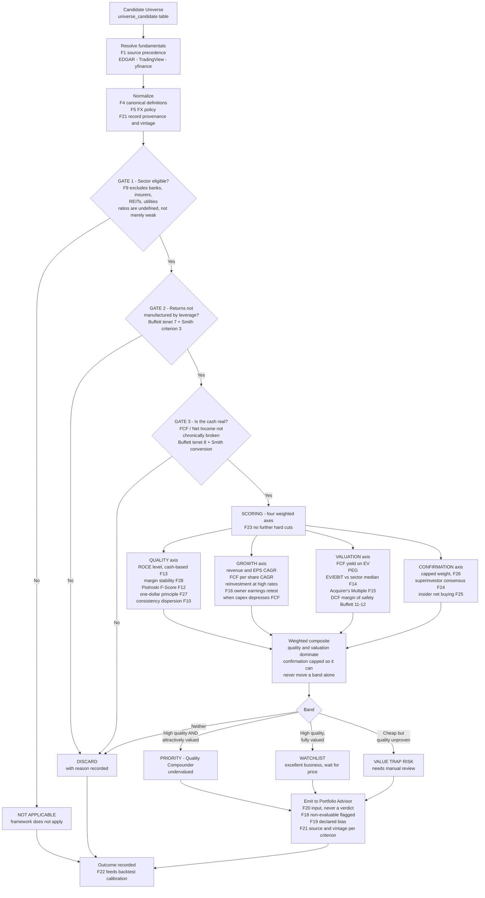

# Opportunity Screener — Factor Catalog and Feasibility Map

Research artifact. No implementation. Establishes the factors required to run a
**Quality + Growth + Undervalued** screen over the Candidate Universe, maps each factor
to capabilities that already exist in this repository, and marks what is missing.

- **Status:** research / pre-proposal
- **Companion document:** [`docs/TODO.md`](./TODO.md) — OpenSpec requirements derived from this catalog
- **Related module inventory:** [`docs/modules.md`](./modules.md)

### Revision 2 — what changed

1. **Relaxed gating (F23).** The screen moves from eleven sequential hard cuts to **three hard gates plus a weighted score**. The original tree rejected nearly everything, and rejected on source disagreement rather than business quality. The objective is a ranked shortlist of quality businesses trading below fair value, not an empty result set.
2. **Buffett + Smith combined checklist (§5).** Both frameworks stated as published, with their six convergences and — more usefully — their six direct contradictions, including one that rejects part of the current portfolio.
3. **Behavioral confirmation signals (F24–F26).** Superinvestor consensus and insider net buying, added as capped confirmation, never as gates.
4. **Two new libraries evaluated (§2.2).** `superinvestor` is usable; `stocksera` is not — its hosted API returns 404 on every documented path.
5. **Two new quality factors (F27, F28).** Buffett's one-dollar principle and pricing power measured through margin stability.

---

## 1. Source Checklist

The originating strategy defines eleven criteria across three blocks.

### Block A — Growth and Business Momentum

| ID | Criterion | Threshold |
|---|---|---|
| A1 | Revenue growth CAGR (3y and 5y) | > 7–10% annual |
| A2 | EPS growth vs revenue growth | EPS growth > revenue growth |
| A3 | FCF per share CAGR | > 8–12% |
| A4 | Historical consistency | ≥ 8 of last 10 years positive |

### Block B — Intrinsic Quality (Moat)

| ID | Criterion | Threshold |
|---|---|---|
| B1 | ROCE / ROIC, 5–10 year average | > 15–18% |
| B2 | FCF / Net Income conversion | > 100% |
| B3 | Net Debt / EBITDA | < 2.0x, or net cash |

### Block C — Valuation and Margin of Safety

| ID | Criterion | Threshold |
|---|---|---|
| C1 | FCF Yield on Enterprise Value | > 5.5–7% |
| C2 | PEG ratio | < 1.2x, ideally < 1.0x |
| C3 | EV/EBIT discount vs its own historical median | > 20% discount |

---

## 2. Data Coverage Assessment

### 2.1 What exists today

| Source | Delivers | Hard limit |
|---|---|---|
| `plugins/stock-valuation/scripts/fetch_financials.py` (yfinance) | `hist_revenue`, `hist_net_income`, `hist_eps`, `hist_fcf`, gross/operating/net margins, Rule of 40, **full 9-point Piotroski F-Score** | `years_count = min(5, len(financials.columns))` — **5 years maximum** |
| `plugins/stock-valuation/scripts/standardize_metrics.py` | `calculate_cagr()`, canonical calculation policy | — |
| `investment_screener/backend/py_services/framework_score.py` | `roic`, `fcfYield`, `evSales`, `debtEbitda`, `interestCoverage`, `currentRatio`, `revenueGrowth`, `ruleOf40`, `operatingMargin`; sector-aware; STRONG_BUY / CONSIDER / AVOID band | Point-in-time only, no multi-year averages. Marked "informational only" |
| `investment_screener/backend/py_services/edgar_facts.py` | SEC XBRL company facts, point-in-time with real filing dates | **US filers only** |
| `investment_screener/backend/py_services/peer_bench.py` | Peer benchmarking scaffold | Partial |
| `investment_screener/backend/py_services/market_regime.py`, `macro_regime.py` | Cycle positioning | Not wired to valuation thresholds |

### 2.2 Library evaluation

**`shner-elmo/TradingView-Screener` — high value for this objective.**

Uses TradingView's official scanner API. Relevant fields confirmed present in the
[stock field reference](https://shner-elmo.github.io/TradingView-Screener/fields/stocks.html):

| Need | Field |
|---|---|
| ROIC | `return_on_invested_capital`, `return_on_invested_capital_fy`, `return_on_invested_capital_fq` |
| **ROCE** (yfinance does not provide it) | `return_on_capital_employed_fy`, `return_on_capital_employed_fq` |
| Revenue CAGR | `total_revenue_cagr_5y`, `total_revenue_5y_growth_fy` |
| EPS CAGR | `earnings_per_share_basic_cagr_5y` |
| FCF CAGR | `free_cash_flow_cagr_5y` |
| Net income CAGR | `net_income_cagr_5y` |
| FCF per share | `free_cash_flow_per_share_ttm`, `_fq`, `_fy` |
| PEG (precomputed) | `price_earnings_growth_ttm` |
| FCF yield on EV (invert) | `enterprise_value_to_free_cash_flow_ttm` |
| EV/EBIT | `enterprise_value_to_ebit_ttm` |
| EV/EBITDA | `enterprise_value_ebitda_ttm`, `_current`, `_fwd` |
| Net debt leverage | `net_debt_to_ebitda_fq`, `net_debt_to_ebitda_fy`, `net_debt` |
| Margins | `gross_margin`, `free_cash_flow_margin_ttm`, `free_cash_flow_margin_fy` |
| Graham floor | `graham_numbers_ttm`, `graham_numbers_fy` |
| Historical slices | `free_cash_flow_ttm_h`, `total_revenue_fq_h` (type `num_slice`), `earnings_fq_h` (type `interface`) — **depth undocumented, must be probed empirically** |

Coverage: ~70 countries including TSX, which EDGAR does not cover.

**`superinvestor` (PyPI) — applicable, with caveats.**

MIT, no API key, v0.2.0 published July 2026. Wraps [DataRoma](https://www.dataroma.com), which aggregates SEC 13F filings for **82 curated superinvestors** including Buffett (Berkshire), Terry Smith (Fundsmith), Klarman (Baupost), Li Lu (Himalaya), Ackman, Einhorn.

| Method | Returns |
|---|---|
| `.buys(period="q"\|"6m", n)` | Stocks bought by multiple superinvestors, with `buy_count` |
| `.sells(period, n)` | Same, sell side |
| `.holdings(n)` | Grand consensus portfolio ranked by `ownership_count`, plus `max_pct` and `avg_hold_price` |
| `.stock(symbol)` | `ownership_count`, `ownership_rank`, `avg_hold_price`, `quarterly_activity` (buy / add / reduce / sell / net, with counts and share deltas), and per-holder detail (`manager`, `firm`, `portfolio_pct`, `activity`, `activity_pct`, `position_value`) |
| `.managers()` | The 82 tracked investors with portfolio value and top holdings |

The `.stock()` method is the useful one for this program: it answers "is the smart-money flow into this name positive or negative, and is Buffett or Smith among the holders".

**Risks:** it scrapes DataRoma rather than consuming an official API, and the project states it is not affiliated. A DataRoma request with a non-browser user agent returns **HTTP 406**, confirming bot filtering — the library is one layout or policy change away from breaking. Underlying data is 13F, so it inherits the **45-day lag** and shows only long US equity positions.

**`stocksera` (PyPI) — not usable. The hosted API appears dead.**

On paper it is the best fit for insider data: `insider_trading(ticker, date_from, date_to, limit)`, `latest_insider_trading_summary()`, plus `senate()` and `house()` congressional trades, `sec_fillings()`, `short_volume()`, `ftd()`, `borrowed_shares()`, and news sentiment.

In practice:

| Check | Result |
|---|---|
| Last PyPI release | **0.1.21, 27 March 2022** — nearly four years stale |
| `stocksera.pythonanywhere.com/` | HTTP 404 |
| `/accounts/developers/` (the documented signup path) | HTTP 404 |
| `/api/insider_trading/` | HTTP 404 |
| `github.com/guanquann/Stocksera` | HTTP 200 — source still present |

Every documented endpoint of the hosted service returns 404, and the API requires a key obtained from a signup page that no longer resolves. The client is a thin wrapper over that service, so the package cannot function. Self-hosting from the GitHub source is a separate infrastructure project, not a dependency.

**Conclusion for insider data: use SEC EDGAR directly.** Form 3/4/5 filings are available free via `https://data.sec.gov/submissions/CIK{cik}.json` filtered on `form: "4"`. `edgar_facts.py` already implements the throttling, caching and mandatory `USER_AGENT` the SEC requires — the pattern is solved, only the client is missing. Limitation: US filers only. Canadian insiders report to **SEDI**, a separate system with a separate parser.

**`coding-kitties/PyIndicators` — not applicable to this objective.**

Pure technical analysis library (SMA, EMA, WMA, RSI, MACD, ADX, Stochastic, Williams %R,
divergences, Fair Value Gap, liquidity zones). A search for "fundamental" in its README
returns zero matches. It contributes nothing to this checklist.

It does have separate, unrelated value: it computes indicators locally over OHLC data with
no external dependencies beyond pandas/polars, which would sidestep [pitfall #7](../AGENTS.md)
(`tv_call("quote", sym)` reads the active chart regardless of the symbol passed, making TV CDP
unusable for batch technical sweeps). **Evaluate separately; out of scope here.**

### 2.3 Criterion-by-criterion verdict

| ID | Repo today | TV-Screener | Verdict |
|---|---|---|---|
| A1 | Derivable (5y history + `calculate_cagr`) | `total_revenue_cagr_5y` | ✅ Covered |
| A2 | Derivable | `earnings_per_share_basic_cagr_5y` | ✅ Covered |
| A3 | FCF yes, historical share count no | `free_cash_flow_per_share_*`, `free_cash_flow_cagr_5y` | ✅ Covered by library |
| A4 | ❌ 5 years only | ⚠️ `*_h` slices, depth unknown | 🔴 **Blocked** — see §4.1 |
| B1 | Point-in-time only | `return_on_capital_employed_fy/fq` | ⚠️ Value yes, multi-year average no |
| B2 | ✅ Both series exist; Piotroski already tests `op_cash > net_inc` | `free_cash_flow_ttm`, `net_income` | ✅ Covered |
| B3 | ✅ `framework_score.debtEbitda` | `net_debt_to_ebitda_fq/fy` | ✅ Covered |
| C1 | ⚠️ `fcfYield` exists — **must verify EV-based vs market-cap-based** | `enterprise_value_to_free_cash_flow_ttm` | ✅ Covered, definition to confirm |
| C2 | Derivable (P/E + `get_estimates`) | `price_earnings_growth_ttm` | ✅ Covered |
| C3 | ❌ No multiple time series stored | ❌ Current/forward only, no history of the multiple | 🔴 **Not solved by either library** — see §4.2 |

**Score: 8 of 11 covered, 1 partial, 2 blocked.**

---

## 3. Factor Catalog

Twenty-two factors, grouped. Each carries provenance and the repository capability it maps to.

### 3.1 Data and Sources

#### F1 — Explicit source precedence

Three fundamentals sources (EDGAR, TradingView, yfinance) will disagree. Without a declared
precedence order and per-field provenance, the screener produces numbers nobody can defend.

`standardize_metrics.py` exists explicitly to prevent "AI split-brain math", and
[rule #2](../AGENTS.md) forbids inline financial computation. Adding a third source without a
precedence policy defeats both.

- **Proposed order:** EDGAR (point-in-time, US) → TradingView (global breadth, precomputed ratios) → yfinance (fallback)
- **Existing:** `standardize_metrics.py` canonical policy, `market_data.py` already prefers EDGAR when a CIK is available
- **Gap:** No formal precedence rule, no per-field provenance record

#### F2 — Uneven historical depth

| Source | Depth | Coverage |
|---|---|---|
| yfinance | 5 years | Global |
| EDGAR | 10+ years, point-in-time | US filers only |
| TradingView `*_h` slices | Unknown | ~70 countries |

- **Existing:** `edgar_facts.py`
- **Gap:** TV slice depth must be probed empirically before any criterion depends on it

#### F3 — Point-in-time versus restated data

TradingView and yfinance return the current, restated view. EDGAR carries filing dates.
Backtesting the checklist against restated data introduces **look-ahead bias** and the
resulting performance figure is not real.

- **Existing:** `backtest_harness.py`, `grade_predictions.py`, `harvest_predictions.py`; `edgar_facts.py` is point-in-time correct
- **Gap:** No policy connecting them; backtest would silently use restated inputs

#### F4 — One canonical definition per ratio

Three definitions of the same concept, three different numbers:

| Author | ROIC / ROCE definition |
|---|---|
| Greenblatt | `EBIT / (net working capital + net fixed assets)` — deliberately excludes goodwill, uses tangible capital |
| Terry Smith | Cash return on operating capital employed (assets minus liabilities), measured **in cash** |
| TradingView | `return_on_invested_capital` — TradingView's own methodology |

A 15–18% threshold is meaningless until one definition is fixed.

- **Existing:** `framework_score.py` has its own canonical policy
- **Gap:** No declared choice; mixing precomputed TV ratios with locally computed ones breaks cross-ticker comparability

#### F5 — Currency and FX

TradingView covers ~70 countries with fundamentals in local currency. [Rule #27](../AGENTS.md)
forbids external FX APIs; rates must be inferred from TradingView's native values.

- **Gap:** No multi-currency normalization policy for cross-market yield comparison

#### F6 — Rate limits, caching, and Terms of Service

The TradingView-Screener README explicitly warns about server load and potential bans.
Real-time data requires session cookies. For fundamentals this is irrelevant — they update
quarterly and the 900-second delayed feed is sufficient, which **avoids the authenticated-session
question entirely**.

- **Existing:** `edgar_facts.py` implements `_throttled_get()` plus `cache_get`/`cache_set` — the pattern to reuse
- **Gap:** Not applied to a TradingView client

### 3.2 Evaluation Method

#### F7 — Rank rather than threshold

Greenblatt's Magic Formula never states "ROC > 15%". It ranks the entire universe by return on
capital and by earnings yield, then sums the ranks. Ranking is robust to definitional error;
a hard binary cut is not. With data drawn from three sources, a 14.9% versus 15.1% boundary
produces false rejects driven by source disagreement rather than business quality.

- **Existing:** `compute_conviction_scores.py` already implements banded scoring (−6..+6)
- **Gap:** The source decision tree uses hard cuts throughout

#### F8 — Sector and cycle adjustment of thresholds

Burry, on his own screening process: *"I will screen through large numbers of companies by
looking at the enterprise value/EBITDA ratio, though the ratio I am willing to accept tends to
vary with the industry and its position in the economic cycle."*

- **Existing:** `framework_score.py` is already sector-aware (`saas_cyber`, `chips_ai`, `energy_infra`); `market_regime.py` and `macro_regime.py` supply cycle context
- **Gap:** Cycle context is not wired to valuation thresholds

#### F9 — Hard sector exclusion

ROIC, EV/EBIT and Net Debt/EBITDA are meaningless for banks, insurers, REITs and utilities.
Greenblatt's Magic Formula explicitly excludes financials and utilities. Without exclusion the
screen returns noise wearing the appearance of rigor.

- **Gap:** No exclusion list exists

#### F10 — Stability instead of streak

Replace "8 of last 10 years positive" with the standard deviation of growth and margins over the
available window. A business growing 10% in good years and contracting 5% in bad ones has a
fundamentally different risk profile from one swinging +40% / −30% at the same CAGR. The first is
predictable and valuable; the second requires guessing.

- **Existing:** `hist_revenue`, `hist_eps`, `hist_fcf`, and historical margin arrays already computed in `fetch_financials.py`
- **Gap:** No dispersion metric computed from them

#### F11 — Gate on quality, rank on price, never mix

Quality is pass/fail. Valuation is an ordering. Collapsing both into a single composite score
hides *why* a candidate passed or failed, which is precisely the information needed to act.

- **Existing:** `framework_score.py` produces a single 0–100 composite — the opposite pattern
- **Gap:** No separation between gate and rank

### 3.3 Substitute Metrics for the Blocked Criteria

#### F12 — Piotroski F-Score as consistency proxy ⭐

**Highest-value finding in this research.** The full 9-point Piotroski F-Score is already
implemented in `fetch_financials.py` and is not used for this purpose.

Piotroski requires **two years**, not ten, and tests exactly what the ten-year streak attempts to
capture. The existing implementation already checks:

| Signal | Implemented as |
|---|---|
| Accrual quality | `op_cash > net_inc` |
| Deleveraging | `leverage < prev_leverage` |
| No dilution | `shares <= prev_shares` |
| Margin expansion | `gross_margin_improving` |
| Asset efficiency | `asset_turnover_improving` |
| Profitability, trend, cash generation, liquidity | remaining four points |

Validea lists Piotroski as a standalone guru screen ("Book/Market — Joseph Piotroski").

- **Existing:** ✅ Complete, in `fetch_financials.py`
- **Gap:** Not surfaced, not used as an A4 substitute

#### F13 — Cash ROCE plus conversion as durability proxy

Terry Smith / Fundsmith does not count positive years. The definition of quality is *"a business
that can sustain a high return on operating capital employed **in cash**"* — capital employed being
assets minus liabilities, and the return measured in cash rather than accrual. Combined with a
requirement for high and consistent cash conversion. Fundsmith's portfolio operates around
25–30% cash ROCE.

High accounting ROCE with 60% cash conversion is a false signal. **Criterion B2 is already the
second half of this filter** — the two are closer than they appear.

- **Existing:** B2 is derivable today from existing series
- **Gap:** Cash-based ROCE is not computed

#### F14 — Sector-relative EV/EBIT instead of self-historical median

Measuring the discount against the sector median isolates the idiosyncratic discount from the
sector's structural economics. Requires no historical accumulation and is available immediately
via a TradingView cohort query.

- **Existing:** `peer_bench.py` is partially there; TV-Screener supplies the cohort in one query
- **Gap:** No sector median computation or discount metric

#### F15 — Acquirer's Multiple: EV / Operating Earnings, top-down

Carlisle's construction detail matters: operating earnings is built **from the top of the income
statement downward** rather than taking reported EBIT, specifically to standardize the metric and
make it comparable across companies and industries. Solves the comparability problem C3 was
reaching for, without a historical series.

- **Gap:** Not implemented

#### F16 — Owner Earnings

Buffett, 1986 shareholder letter:

```
Reported earnings
+ Depreciation, depletion, amortization, other non-cash charges
− Average annual MAINTENANCE capital expenditure required
  to sustain competitive position
```

The operative word is *maintenance*. Free cash flow penalizes a business investing heavily to
grow; owner earnings does not. For a checklist targeting quality compounders this is the more
appropriate metric — and it is the reason criterion A3 may reject exactly the businesses the
strategy wants.

The known practical difficulty: separating maintenance from growth capex does not come out of the
financial statements, which is why the metric is widely cited and rarely computed. The standard
proxy is to use D&A as the maintenance capex estimate — imperfect but defensible.

- **Existing:** OCF, capex and D&A are all already retrieved in `fetch_financials.py`
- **Gap:** Not computed

#### F17 — Snapshot accumulation for C3 (optional, low priority)

Storing periodic snapshots of `enterprise_value_to_ebit_ttm` would make a self-historical median
usable in 2–3 years.

**Counter-evidence:** Alpha Architect tested relative-value strategies that buy stocks trading
below their own long-run historical valuation and found they did **not** outperform traditional
systematic value (plain absolute cheapness). The criterion that is hardest to implement may be
the least valuable of the three in Block C.

A counter-argument exists — the structurally-cheap-sector problem, where banks, integrated oil and
auto OEMs always look cheap in absolute terms — so the question is not settled. But the evidence
does not currently justify the accumulation cost.

- **Recommendation:** Defer. Implement F14 instead.

### 3.4 Product and User

#### F18 — Non-evaluable criteria must display as non-evaluable

Without A4 and C3 the screen runs on 8 of 11 criteria. Presenting that as a complete checklist is
dishonest. Missing criteria must render as *not evaluable*, never as passed.

#### F19 — Declared structural bias

The checklist is structurally anti-momentum and anti-turnaround, and penalizes growth capex. It
will reject compounders during heavy-investment years and cyclicals at the bottom of the cycle.
This is a deliberate stance, not a defect — but it must be visible to the user rather than
discovered when the screen rejects a good business.

#### F20 — The screener feeds the Advisor, it does not replace it

Eleven green checkboxes are not an investment thesis. Presented as a verdict, the user will treat
a checklist as due diligence. It belongs upstream of the Portfolio Advisor as a candidate filter.

#### F21 — Per-check traceability

Each criterion should display which source, which vintage, and which definition backs it.

- **Existing:** `PriceSourceBadge.tsx` is the established precedent; `audit_staleness.py` exists

#### F22 — Backtest validation before committing capital

Any variant of this screen can be validated against the repository's own history before it is
trusted. Subject to F3 — restated inputs invalidate the exercise.

- **Existing:** `backtest_harness.py`, `grade_predictions.py`

### 3.5 Behavioral Confirmation and Calibration of Strictness

These factors were added after the original catalog. F23 responds to a direct instruction to make
the screen **less strict and genuinely aimed at quality undervalued businesses**, rather than a
filter so tight that nothing survives it.

#### F23 — Few hard gates, everything else scored ⭐

The original decision tree is a chain of binary cuts. Eleven sequential hard thresholds over data
drawn from three disagreeing sources produce a screen that rejects almost everything, and rejects
it for the wrong reasons — a 14.9% ROIC computed by one source and 15.4% by another decides the
outcome, not the business.

Both reference frameworks are looser than the source checklist in exactly this way. Greenblatt
**ranks** rather than thresholds. Terry Smith publishes his six criteria **qualitatively**; the
numeric cutoffs circulating under his name are third-party reconstructions, not Fundsmith
publications. Buffett's twelve tenets are explicitly described by Hagstrom as principles where
*"not all of Buffett's purchases display all these tenets"*.

**Proposed model:** three non-negotiable gates, everything else contributes to a composite score.

| Non-negotiable gate | Rationale |
|---|---|
| **Sector eligible** (F9) | The ratios are undefined for banks, insurers, REITs and utilities. Not a judgement, a definitional issue |
| **Returns not manufactured by leverage** | Buffett tenet 7 and Smith criterion 3 converge exactly here. A high return produced by a shrunken equity denominator is not quality |
| **Cash is real** | FCF / Net Income not chronically broken. Buffett tenet 8 and Smith's cash conversion converge here. Protects against accounting-only quality |

Everything else — growth rates, consistency, margins, valuation, confirmation — becomes a weighted
score with bands. A business failing one growth criterion while excelling on five others should
surface as a candidate, not vanish.

- **Existing:** `compute_conviction_scores.py` already implements banded scoring (−6..+6); `framework_score.py` already produces a 0–100 composite with bands
- **Gap:** The proposed tree does not use either

#### F24 — Superinvestor consensus as a confirmation signal

The thesis behind the `superinvestor` library: *"If one investor buys a stock, it could mean
anything. If ten legendary investors independently buy the same stock, pay attention."*

Relevant because two of the eighty-two tracked managers are **Buffett and Terry Smith** — the exact
frameworks this program is built on. A candidate that passes the local screen *and* appears in
Fundsmith's or Berkshire's holdings is independently corroborated by the authors of the method.

**Rules that must accompany it:**

- **Confirmation, never a gate.** 13F data is 45 days stale and shows only long US equity positions. Requiring it would reject every non-US candidate and every idea earlier than the crowd — which is where the return is
- **Consensus count, not a single name.** `ownership_count` and net `quarterly_activity` matter; one manager's position does not
- **Direction beats level.** A rising `ownership_count` with positive net activity is a different signal from a large but shrinking consensus
- `avg_hold_price` versus current price indicates whether you would be entering below or above the smart-money basis

- **Gap:** No superinvestor data anywhere in the repository
- **Adjacent existing capability:** the `/13f` module already tracks one fund's filings from local JSON. This generalizes it to 82 and automates the fetch

#### F25 — Insider net buying as a confirmation signal

Every other criterion in this catalog derives from financial statements the company itself
authors. A director buying with personal money in the open market is the one signal in the set
that **cannot be produced by accounting policy**.

**Rules that must accompany it:**

- **Buys inform; sells barely do.** Insiders sell for diversification, tax, divorce or a house. They buy for one reason. Filter on transaction code `P` (open-market purchase); discard `A` (award) and `M` (option exercise), which are compensation rather than conviction
- **Clusters, not individuals.** Several insiders buying within one window is the signal; a single filer is noise
- **Weight by role and size** relative to the filer's known compensation
- **Confirmation, never a gate.** Most quality businesses have no recent insider buying at all. Absence is not evidence

- **Source:** SEC EDGAR `submissions` API, Form 4. Free, US only
- **Gap:** Nothing in the repository touches Forms 3/4/5. `edgar_facts.py` consumes only the XBRL `companyfacts` endpoint
- **Canada:** insiders file to SEDI, a separate system. Out of scope initially

#### F26 — Lag discipline on confirmation signals

Both confirmation sources are lagging and asymmetric, in different ways:

| Signal | Lag | Granularity |
|---|---|---|
| 13F / superinvestor | 45 days after quarter end | Quarterly snapshot, no transaction dates |
| Form 4 / insider | 2 business days | Individual transaction with date, price, quantity |

They must be displayed with their vintage (F21) and must never contribute enough weight to move a
candidate across a band on their own. A 45-day-old quarterly snapshot cannot outvote current
fundamentals.

#### F27 — One-dollar principle

Buffett tenet 10: for every dollar retained, at least one dollar of market value created. Retain
$100M in earnings and market capitalization should rise by at least $100M, measured over several
years rather than quarters.

It is the only criterion in the combined framework that tests **capital allocation outcomes**
rather than inputs, and it needs no analyst judgement — retained earnings and market value are
both observable.

- **Gap:** Not computed. Requires cumulative retained earnings and the corresponding change in market capitalization over the same window

#### F28 — Pricing power via margin stability

Buffett tenet 3 defines a franchise as a product that is needed or desired, has no close
substitute, and is not regulated — which yields **pricing flexibility**. Tenet 9 asks for high
margins from structural cost discipline rather than one-off restructuring.

Neither is directly observable, but both leave the same fingerprint: **gross margin that holds or
expands through a downturn**. Fundsmith reports portfolio return on capital, gross margins and
operating margins as *"all high and steady"* — steady being the operative word.

- **Existing:** `hist_gross_margin`, `hist_operating_margin` and `hist_net_margin` are already computed in `fetch_financials.py`
- **Gap:** Stability across the series is never measured. Overlaps with F10

---

## 4. Blocked Criteria — Resolution Options

### 4.1 A4 — Ten-year consistency

The criterion is Buffett's, verbatim. Validea encodes it identically: *"EPS has increased in at
least 8 out of the last 10 years"*, as a measure of earnings predictability.

| Option | Cost | Coverage | Notes |
|---|---|---|---|
| **F12 — Piotroski substitute** | None, already built | Global | Recommended. Two-year requirement |
| **F10 — Stability metric** | Low | Global | Complements F12 |
| **EDGAR strict path** | Low, client exists | US only | Apply strict criterion where data allows, proxy elsewhere, **declare which was used** |
| **TV `*_h` slices** | Probe required | ~70 countries | Depth unverified |
| **Self-accumulation** | 10 years | Global | Not viable |

Buffett-Hagstrom (AAII) offers a validated relaxed variant — positive gross operating income,
positive free cash flow, history of shareholder returns — reporting 13.8% annualized since 1998
against the S&P 500's 7.4%, without requiring the ten-year streak.

### 4.2 C3 — EV/EBIT versus own historical median

| Option | Cost | Evidence | Notes |
|---|---|---|---|
| **F14 — Sector-relative** | Low | Contested but supported | Recommended. Available today |
| **F15 — Acquirer's Multiple** | Medium | Established | Absolute, standardized, no history needed |
| **F8 — Cycle-adjusted absolute** | Medium | Burry's stated method | Reuses existing regime scripts |
| **F17 — Accumulate snapshots** | 2–3 years | **Negative** (Alpha Architect) | Defer |

Damodaran adds a methodological caution: select the multiple by regressing each candidate multiple
against sector fundamentals and keeping the one with the highest R². In some sectors EV/EBIT is
not the multiple that explains value, and forcing it produces noise.

---

## 5. The Buffett + Smith Combined Checklist

The strategy target is *quality businesses that are undervalued*. Two frameworks define that most
directly. This section states what each actually says, where they converge, and — more importantly
— where they contradict each other.

### 5.1 Buffett — twelve tenets (Hagstrom, *The Warren Buffett Way*)

Distilled from Berkshire annual reports back to 1966. Hagstrom is explicit that *not all of
Buffett's purchases display all these tenets* — they are principles, not a gate chain.

| # | Tenet | Test or metric |
|---|---|---|
| **Business** | | |
| 1 | Simple and understandable | Circle of competence |
| 2 | Consistent operating history | *"Severe change and exceptional returns usually don't mix"* |
| 3 | Favorable long-term prospects | A **franchise**: needed or desired product, no close substitute, not regulated → **pricing flexibility**. Should still work in 25–30 years |
| **Management** | | |
| 4 | Rational | **Capital allocation** appropriate to life-cycle stage. Buybacks only below intrinsic value |
| 5 | Candid with shareholders | Reports let a literate reader estimate value, obligations, and managerial performance |
| 6 | Resists the institutional imperative | No mindless peer imitation, no activity for its own sake |
| **Financial** | | |
| 7 | **ROE, not EPS** | EPS rises merely because retained earnings enlarge the base. Value marketable securities **at cost, not market**; exclude extraordinaries. Must be achieved **with little or no debt** — leverage inflates ROE by shrinking the denominator |
| 8 | **Owner earnings** | `Net income + D&A − Capex − Additional working capital required`. Guards against "ersatz earnings" and against standard cash flow, which ignores required reinvestment |
| 9 | High profit margins | Structural cost discipline, not restructuring. Berkshire's own benchmark: after-tax corporate expense **under 1% of operating earnings**, roughly one-tenth of peers its size |
| 10 | **One-dollar principle** | Each dollar retained creates ≥ one dollar of market value, measured over years |
| **Value** | | |
| 11 | What is the business worth | **DCF on owner earnings**, discounted at the risk-free rate or ~10% opportunity cost. **P/E and P/B explicitly rejected in 1992.** *"Approximately right rather than precisely wrong"* |
| 12 | Margin of safety | Gap between price and estimated intrinsic value. A 25% discount means a subsequent 10% decline in value still leaves the purchase profitable |

### 5.2 Smith — six published criteria (Fundsmith factsheet)

Verbatim from the fund. The three-step process is **buy good companies → don't overpay → do nothing**.

1. High quality businesses that can sustain a **high return on operating capital employed**
2. Businesses whose advantages are **difficult to replicate**
3. Businesses that **do not require significant leverage** to generate returns
4. Businesses with a **high degree of certainty of growth from reinvestment** of cash flows at high rates of return
5. Businesses **resilient to change, particularly technological innovation**
6. Businesses whose **valuation is attractive**

Three of the fourteen Owner's Manual filters add information beyond those six:

- **Filter 3** — seeks businesses whose assets are **intangible and difficult to replicate**, because they *"break the rule of mean reversion that states returns must revert to the average as new capital is attracted to business activities earning super-normal returns"*
- **Filter 7** — resilience means resistance to product obsolescence. *"We do not invest in industries which are subject to rapid technological innovation."* Canals, railroads, aviation, **microchips** and the internet transformed industries and **destroyed capital** for many investors
- **Filter 13** — *"We are rather more comfortable analysing numbers than we are trying to gain insights into companies by meeting the management"*

**Threshold caveat:** Fundsmith publishes these criteria qualitatively and publishes portfolio
aggregates, not cutoffs. Numeric thresholds circulating under Smith's name (ROCE ≥ 20%, gross
margin ≥ 45%, P/E ≤ 35) are **third-party reconstructions**. Stockopedia says so explicitly of its
own screen. One genuinely published reference point: the portfolio's weighted average FCF yield
closed a year at **3.7% against 2.8% for the S&P 500**, with return on capital and margins
described as *"all high and steady"*.

### 5.3 Convergence — the reliable core

Six points survive both frameworks. **This is the combined checklist that actually matters.**

| Concept | Buffett | Smith |
|---|---|---|
| **High return on capital, unlevered** | Tenet 7 — ROE achieved with little or no debt | Criterion 3 — no leverage required to generate returns |
| **Cash reality over accrual** | Tenet 8 — owner earnings | Cash conversion; returns measured in cash |
| **Durable, hard-to-replicate moat** | Tenet 3 — franchise with pricing flexibility | Criterion 2 + Filter 3 — intangible advantages that break mean reversion |
| **Reinvestment at high rates** | Tenet 4 + Tenet 10 — rational allocation, one-dollar principle | Criterion 4 — certainty of growth from reinvestment |
| **Consistency, absence of severe change** | Tenet 2 | Criterion 5 — resilience to change |
| **Do not overpay** | Tenets 11–12 — DCF plus margin of safety | Criterion 6, Filter 8, step 2 of the process |

### 5.4 Divergence — where they contradict

| # | Conflict | Buffett | Smith |
|---|---|---|---|
| 1 | **Tangible vs intangible assets** | Owns BNSF, utilities, insurance — capital-intensive, tangible | Filter 3 explicitly seeks intangible-asset businesses |
| 2 | **Technology** | Apple became his largest position | Filter 7 avoids rapid technological innovation and names **microchips** as a capital destroyer |
| 3 | **Assessing management** | 3 of 12 tenets, qualitative, requires reading and judgement | Filter 13 prefers numbers to meeting management |
| 4 | **Valuation method** | Absolute: DCF on owner earnings with margin of safety. Rejects P/E and P/B | Relative: FCF yield against the market |
| 5 | **Financials** | Banks and insurance are core to Berkshire; insurance float is the engine | Excluded — they require leverage to generate satisfactory returns |
| 6 | **Cyclicals** | Buys them at the bottom of the cycle | Avoids them for revenue lumpiness |

### 5.5 The tension this creates for this portfolio

Applied literally, the combined checklist **rejects a significant part of the current portfolio.**
Smith's Filter 7 names microchips specifically; the `chips_ai` pillar lives there. His cyclical
exclusion reaches `energy_infra`.

Three honest resolutions:

1. **Adopt Smith in full** and accept that the current portfolio does not pass — meaning change the portfolio
2. **Adopt the convergent core only** (§5.3) and drop Filter 7, following Buffett with Apple: technology is not disqualified; what matters is whether a franchise with pricing power exists
3. **Apply per pillar** — full Smith where it fits, convergent core in technology and cyclical pillars, declared explicitly

Option 2 is the most coherent with what already exists, but this is a product decision, not a
technical one. Neither framework answers it.

### 5.6 Broader method compatibility

| Approach | Compatibility | Rationale |
|---|---|---|
| **Terry Smith / Fundsmith** | ✅ High | Quality + growth + reasonable price. Cash ROCE plus conversion. No ten-year streak requirement. Excludes heavy cyclicals, consistent with the existing pillar structure |
| **Greenblatt — Magic Formula** | ✅ High | ROC plus earnings yield, ranked rather than thresholded. Addresses B1 and C1 together. Its exclusion of financials and utilities is the sector exclusion F9 requires anyway |
| **Carlisle — Acquirer's Multiple** | ✅ Medium-high | Standardized top-down EV/Operating Earnings. Resolves C3 without a historical series. Deep-value bias is more contrarian than the current portfolio stance |
| **Buffett-Hagstrom (AAII)** | ✅ Medium | Relaxed, validated criteria. Useful fallback when ten years are unavailable |
| **Michael Burry** | ⚠️ **Low** | His documented method targets illiquid small and micro caps with low share counts, "companies that look like road kill", with high turnover. Incompatible with a pillar-based portfolio holding liquid TradingView-tradeable names on long-horizon theses. The only transferable element is the principle of varying the EV/EBITDA threshold by industry and cycle position (F8) — not the universe |

---

## 6. Proposed Evaluation Flow

Applied to the Candidate Universe (`universe_candidate` table).

**This flow is deliberately less strict than the source decision tree.** Per **F23**, only three
conditions are hard gates; everything else contributes to a weighted score. The original eleven
sequential binary cuts reject nearly everything, and reject on source disagreement rather than on
business quality. Both reference frameworks are looser than that: Greenblatt ranks, Smith publishes
criteria qualitatively, and Hagstrom states that not all of Buffett's purchases display all twelve
tenets.

The goal is a **ranked shortlist of quality businesses trading below what they are worth**, not a
filter that returns an empty set.



### Design decisions encoded in the flow

1. **Three hard gates, not eleven** (F23). Sector eligibility, leverage-free returns, and cash reality. The first is definitional; the other two are the points where Buffett and Smith converge exactly. Everything else is scored, so a business that misses one growth threshold while excelling elsewhere still surfaces.
2. **Sector exclusion runs first** (F9). Computing ROIC for a bank wastes work and produces a number that means nothing.
3. **Four axes, not one number** (F11). Quality and valuation must be visible separately. A single composite hides whether a candidate is a great business at a fair price or a mediocre one that is very cheap.
4. **A fourth band: VALUE TRAP RISK.** Cheap with unproven quality is a distinct outcome deserving manual review, not a silent discard. Recording it feeds calibration (F22).
5. **A3 failure routes to an Owner Earnings retest** (F16) rather than a discard, so heavy-growth-capex compounders are not rejected by construction.
6. **Confirmation is capped** (F26). Superinvestor consensus is 45 days stale; insider buying is sparse and absent for most quality names. Neither may move a candidate across a band on its own.
7. **Every outcome is recorded, including rejections** (F22). Why a candidate failed is as valuable for calibration as why one passed.

## 7. Coverage Summary

| Status | Count | Factors |
|---|---|---|
| ✅ Fully covered | 1 | F12 (built, unused) |
| ⚠️ Partial | 9 | F2, F4, F6, F8, F13, F14, F21, F22, F23 |
| ❌ Not covered | 17 | F1, F3, F5, F7, F9, F10, F11, F15, F16, F18, F19, F20, F24, F25, F26, F27, F28 |
| 🟡 Deferred | 1 | F17 |

**Immediate leverage, ordered by return on effort:**

| Rank | Factor | Why |
|---|---|---|
| 1 | **F12 — Piotroski** | Complete in `fetch_financials.py`, resolves the A4 blocker with data already on hand. Needs exposure, not construction |
| 2 | **F23 — relax the gating** | Design decision, not engineering. Costs nothing and is what makes the screen return usable candidates instead of an empty set |
| 3 | **F16 — owner earnings** | OCF, capex and D&A are already retrieved. Changes outcomes: stops rejecting the compounders the strategy is looking for |
| 4 | **F28 — margin stability** | `hist_gross_margin` and `hist_operating_margin` already computed; only the dispersion measure is missing |
| 5 | **F24 — superinvestor consensus** | One pip-installable dependency, no API key. Buffett and Smith are both among the 82 tracked |
| 6 | **F25 — insider buying** | EDGAR client pattern already solved in `edgar_facts.py`; only the Form 4 endpoint and parser are missing |

---

## 8. Open Decisions

These require a human decision before any implementation proposal is accepted.

1. **§5.5 — the portfolio tension.** Smith's Filter 7 excludes microchips by name and his cyclical exclusion reaches `energy_infra`. Adopt Smith in full, adopt the convergent core only, or apply per pillar? This is the largest decision and it is a product decision, not a technical one.
2. **F4** — Which ROIC/ROCE definition becomes canonical: Greenblatt (tangible capital), Smith (cash-based), or TradingView's?
3. **F23** — Confirm the three proposed hard gates (sector eligibility, leverage-free returns, cash reality) and the relative weights of the four scoring axes.
4. **F1** — Is the proposed precedence (EDGAR → TradingView → yfinance) correct, and is TradingView used for raw inputs only or for its precomputed ratios as well?
5. **F9** — Which sectors are excluded, and does the existing `sector_overrides.py` taxonomy cover them?
6. **F24/F26** — What weight cap do confirmation signals receive, and is DataRoma scraping fragility acceptable for a non-blocking signal?
7. **F17** — Confirm deferral of snapshot accumulation given the negative evidence.
8. **C1** — Verify whether `framework_score.fcfYield` is computed on enterprise value or market capitalization.

---

## 9. References

- Buffett, W. (1986). Berkshire Hathaway shareholder letter — owner earnings definition
- Validea — *Building a Quantitative Strategy Based on Warren Buffett's Approach* (ten-year EPS predictability encoding)
- AAII / Hagstrom — Buffett-Hagstrom screen, 13.8% annualized since 1998 vs S&P 500 7.4%
- Greenblatt, J. *The Little Book That Beats the Market* — ROC and earnings yield ranking
- Smith, T. — Fundsmith Owner's Manual, cash return on operating capital employed
- Carlisle, T. — *The Acquirer's Multiple*, EV / Operating Earnings constructed top-down
- Burry, M. — MSN Money columns (2000–2001), EV/EBITDA varying by industry and cycle position
- Piotroski, J. (2000). F-Score, nine-point financial strength methodology
- Alpha Architect — *Do Relative-Value Strategies Beat Traditional Systematic Value Investing Strategies?*
- Damodaran, A. — *Choosing the Right Relative Valuation Model* (Stern School)
- Stockopedia — *Building a Terry Smith Portfolio with UK Shares* (explicitly states its thresholds are the author's reconstruction, not Smith's)
- Fundsmith — Owner's Manual (14 filters) and factsheet (6 criteria)
- Trustnet — Fundsmith portfolio FCF yield 3.7% vs S&P 500 2.8%
- [TradingView-Screener](https://github.com/shner-elmo/TradingView-Screener) — field reference
- [superinvestor](https://pypi.org/project/superinvestor/) — DataRoma consensus over 82 managers, MIT, v0.2.0 (July 2026)
- [stocksera](https://pypi.org/project/stocksera/) — evaluated; hosted API returns 404 on all documented paths, last release March 2022
- [PyIndicators](https://github.com/coding-kitties/PyIndicators) — evaluated, not applicable here
- SEC EDGAR — `https://data.sec.gov/submissions/CIK{cik}.json`, Forms 3/4/5
