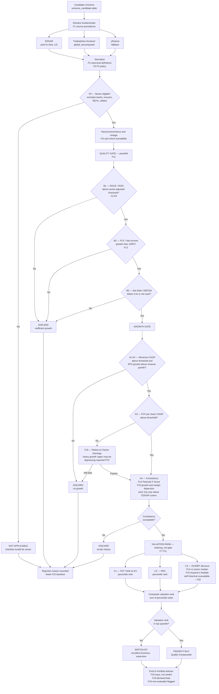

# Opportunity Screener — Factor Catalog and Feasibility Map

Research artifact. No implementation. Establishes the factors required to run a
**Quality + Growth + Undervalued** screen over the Candidate Universe, maps each factor
to capabilities that already exist in this repository, and marks what is missing.

- **Status:** research / pre-proposal
- **Companion document:** [`docs/TODO.md`](./TODO.md) — OpenSpec requirements derived from this catalog
- **Related module inventory:** [`docs/modules.md`](./modules.md)

---

## 1. Source Checklist

The originating strategy defines eleven criteria across three blocks.

### Block A — Growth and Business Momentum

| ID | Criterion | Threshold |
|---|---|---|
| A1 | Revenue growth CAGR (3y and 5y) | > 7–10% annual |
| A2 | EPS growth vs revenue growth | EPS growth > revenue growth |
| A3 | FCF per share CAGR | > 8–12% |
| A4 | Historical consistency | ≥ 8 of last 10 years positive |

### Block B — Intrinsic Quality (Moat)

| ID | Criterion | Threshold |
|---|---|---|
| B1 | ROCE / ROIC, 5–10 year average | > 15–18% |
| B2 | FCF / Net Income conversion | > 100% |
| B3 | Net Debt / EBITDA | < 2.0x, or net cash |

### Block C — Valuation and Margin of Safety

| ID | Criterion | Threshold |
|---|---|---|
| C1 | FCF Yield on Enterprise Value | > 5.5–7% |
| C2 | PEG ratio | < 1.2x, ideally < 1.0x |
| C3 | EV/EBIT discount vs its own historical median | > 20% discount |

---

## 2. Data Coverage Assessment

### 2.1 What exists today

| Source | Delivers | Hard limit |
|---|---|---|
| `plugins/stock-valuation/scripts/fetch_financials.py` (yfinance) | `hist_revenue`, `hist_net_income`, `hist_eps`, `hist_fcf`, gross/operating/net margins, Rule of 40, **full 9-point Piotroski F-Score** | `years_count = min(5, len(financials.columns))` — **5 years maximum** |
| `plugins/stock-valuation/scripts/standardize_metrics.py` | `calculate_cagr()`, canonical calculation policy | — |
| `investment_screener/backend/py_services/framework_score.py` | `roic`, `fcfYield`, `evSales`, `debtEbitda`, `interestCoverage`, `currentRatio`, `revenueGrowth`, `ruleOf40`, `operatingMargin`; sector-aware; STRONG_BUY / CONSIDER / AVOID band | Point-in-time only, no multi-year averages. Marked "informational only" |
| `investment_screener/backend/py_services/edgar_facts.py` | SEC XBRL company facts, point-in-time with real filing dates | **US filers only** |
| `investment_screener/backend/py_services/peer_bench.py` | Peer benchmarking scaffold | Partial |
| `investment_screener/backend/py_services/market_regime.py`, `macro_regime.py` | Cycle positioning | Not wired to valuation thresholds |

### 2.2 Library evaluation

**`shner-elmo/TradingView-Screener` — high value for this objective.**

Uses TradingView's official scanner API. Relevant fields confirmed present in the
[stock field reference](https://shner-elmo.github.io/TradingView-Screener/fields/stocks.html):

| Need | Field |
|---|---|
| ROIC | `return_on_invested_capital`, `return_on_invested_capital_fy`, `return_on_invested_capital_fq` |
| **ROCE** (yfinance does not provide it) | `return_on_capital_employed_fy`, `return_on_capital_employed_fq` |
| Revenue CAGR | `total_revenue_cagr_5y`, `total_revenue_5y_growth_fy` |
| EPS CAGR | `earnings_per_share_basic_cagr_5y` |
| FCF CAGR | `free_cash_flow_cagr_5y` |
| Net income CAGR | `net_income_cagr_5y` |
| FCF per share | `free_cash_flow_per_share_ttm`, `_fq`, `_fy` |
| PEG (precomputed) | `price_earnings_growth_ttm` |
| FCF yield on EV (invert) | `enterprise_value_to_free_cash_flow_ttm` |
| EV/EBIT | `enterprise_value_to_ebit_ttm` |
| EV/EBITDA | `enterprise_value_ebitda_ttm`, `_current`, `_fwd` |
| Net debt leverage | `net_debt_to_ebitda_fq`, `net_debt_to_ebitda_fy`, `net_debt` |
| Margins | `gross_margin`, `free_cash_flow_margin_ttm`, `free_cash_flow_margin_fy` |
| Graham floor | `graham_numbers_ttm`, `graham_numbers_fy` |
| Historical slices | `free_cash_flow_ttm_h`, `total_revenue_fq_h` (type `num_slice`), `earnings_fq_h` (type `interface`) — **depth undocumented, must be probed empirically** |

Coverage: ~70 countries including TSX, which EDGAR does not cover.

**`coding-kitties/PyIndicators` — not applicable to this objective.**

Pure technical analysis library (SMA, EMA, WMA, RSI, MACD, ADX, Stochastic, Williams %R,
divergences, Fair Value Gap, liquidity zones). A search for "fundamental" in its README
returns zero matches. It contributes nothing to this checklist.

It does have separate, unrelated value: it computes indicators locally over OHLC data with
no external dependencies beyond pandas/polars, which would sidestep [pitfall #7](../AGENTS.md)
(`tv_call("quote", sym)` reads the active chart regardless of the symbol passed, making TV CDP
unusable for batch technical sweeps). **Evaluate separately; out of scope here.**

### 2.3 Criterion-by-criterion verdict

| ID | Repo today | TV-Screener | Verdict |
|---|---|---|---|
| A1 | Derivable (5y history + `calculate_cagr`) | `total_revenue_cagr_5y` | ✅ Covered |
| A2 | Derivable | `earnings_per_share_basic_cagr_5y` | ✅ Covered |
| A3 | FCF yes, historical share count no | `free_cash_flow_per_share_*`, `free_cash_flow_cagr_5y` | ✅ Covered by library |
| A4 | ❌ 5 years only | ⚠️ `*_h` slices, depth unknown | 🔴 **Blocked** — see §4.1 |
| B1 | Point-in-time only | `return_on_capital_employed_fy/fq` | ⚠️ Value yes, multi-year average no |
| B2 | ✅ Both series exist; Piotroski already tests `op_cash > net_inc` | `free_cash_flow_ttm`, `net_income` | ✅ Covered |
| B3 | ✅ `framework_score.debtEbitda` | `net_debt_to_ebitda_fq/fy` | ✅ Covered |
| C1 | ⚠️ `fcfYield` exists — **must verify EV-based vs market-cap-based** | `enterprise_value_to_free_cash_flow_ttm` | ✅ Covered, definition to confirm |
| C2 | Derivable (P/E + `get_estimates`) | `price_earnings_growth_ttm` | ✅ Covered |
| C3 | ❌ No multiple time series stored | ❌ Current/forward only, no history of the multiple | 🔴 **Not solved by either library** — see §4.2 |

**Score: 8 of 11 covered, 1 partial, 2 blocked.**

---

## 3. Factor Catalog

Twenty-two factors, grouped. Each carries provenance and the repository capability it maps to.

### 3.1 Data and Sources

#### F1 — Explicit source precedence

Three fundamentals sources (EDGAR, TradingView, yfinance) will disagree. Without a declared
precedence order and per-field provenance, the screener produces numbers nobody can defend.

`standardize_metrics.py` exists explicitly to prevent "AI split-brain math", and
[rule #2](../AGENTS.md) forbids inline financial computation. Adding a third source without a
precedence policy defeats both.

- **Proposed order:** EDGAR (point-in-time, US) → TradingView (global breadth, precomputed ratios) → yfinance (fallback)
- **Existing:** `standardize_metrics.py` canonical policy, `market_data.py` already prefers EDGAR when a CIK is available
- **Gap:** No formal precedence rule, no per-field provenance record

#### F2 — Uneven historical depth

| Source | Depth | Coverage |
|---|---|---|
| yfinance | 5 years | Global |
| EDGAR | 10+ years, point-in-time | US filers only |
| TradingView `*_h` slices | Unknown | ~70 countries |

- **Existing:** `edgar_facts.py`
- **Gap:** TV slice depth must be probed empirically before any criterion depends on it

#### F3 — Point-in-time versus restated data

TradingView and yfinance return the current, restated view. EDGAR carries filing dates.
Backtesting the checklist against restated data introduces **look-ahead bias** and the
resulting performance figure is not real.

- **Existing:** `backtest_harness.py`, `grade_predictions.py`, `harvest_predictions.py`; `edgar_facts.py` is point-in-time correct
- **Gap:** No policy connecting them; backtest would silently use restated inputs

#### F4 — One canonical definition per ratio

Three definitions of the same concept, three different numbers:

| Author | ROIC / ROCE definition |
|---|---|
| Greenblatt | `EBIT / (net working capital + net fixed assets)` — deliberately excludes goodwill, uses tangible capital |
| Terry Smith | Cash return on operating capital employed (assets minus liabilities), measured **in cash** |
| TradingView | `return_on_invested_capital` — TradingView's own methodology |

A 15–18% threshold is meaningless until one definition is fixed.

- **Existing:** `framework_score.py` has its own canonical policy
- **Gap:** No declared choice; mixing precomputed TV ratios with locally computed ones breaks cross-ticker comparability

#### F5 — Currency and FX

TradingView covers ~70 countries with fundamentals in local currency. [Rule #27](../AGENTS.md)
forbids external FX APIs; rates must be inferred from TradingView's native values.

- **Gap:** No multi-currency normalization policy for cross-market yield comparison

#### F6 — Rate limits, caching, and Terms of Service

The TradingView-Screener README explicitly warns about server load and potential bans.
Real-time data requires session cookies. For fundamentals this is irrelevant — they update
quarterly and the 900-second delayed feed is sufficient, which **avoids the authenticated-session
question entirely**.

- **Existing:** `edgar_facts.py` implements `_throttled_get()` plus `cache_get`/`cache_set` — the pattern to reuse
- **Gap:** Not applied to a TradingView client

### 3.2 Evaluation Method

#### F7 — Rank rather than threshold

Greenblatt's Magic Formula never states "ROC > 15%". It ranks the entire universe by return on
capital and by earnings yield, then sums the ranks. Ranking is robust to definitional error;
a hard binary cut is not. With data drawn from three sources, a 14.9% versus 15.1% boundary
produces false rejects driven by source disagreement rather than business quality.

- **Existing:** `compute_conviction_scores.py` already implements banded scoring (−6..+6)
- **Gap:** The source decision tree uses hard cuts throughout

#### F8 — Sector and cycle adjustment of thresholds

Burry, on his own screening process: *"I will screen through large numbers of companies by
looking at the enterprise value/EBITDA ratio, though the ratio I am willing to accept tends to
vary with the industry and its position in the economic cycle."*

- **Existing:** `framework_score.py` is already sector-aware (`saas_cyber`, `chips_ai`, `energy_infra`); `market_regime.py` and `macro_regime.py` supply cycle context
- **Gap:** Cycle context is not wired to valuation thresholds

#### F9 — Hard sector exclusion

ROIC, EV/EBIT and Net Debt/EBITDA are meaningless for banks, insurers, REITs and utilities.
Greenblatt's Magic Formula explicitly excludes financials and utilities. Without exclusion the
screen returns noise wearing the appearance of rigor.

- **Gap:** No exclusion list exists

#### F10 — Stability instead of streak

Replace "8 of last 10 years positive" with the standard deviation of growth and margins over the
available window. A business growing 10% in good years and contracting 5% in bad ones has a
fundamentally different risk profile from one swinging +40% / −30% at the same CAGR. The first is
predictable and valuable; the second requires guessing.

- **Existing:** `hist_revenue`, `hist_eps`, `hist_fcf`, and historical margin arrays already computed in `fetch_financials.py`
- **Gap:** No dispersion metric computed from them

#### F11 — Gate on quality, rank on price, never mix

Quality is pass/fail. Valuation is an ordering. Collapsing both into a single composite score
hides *why* a candidate passed or failed, which is precisely the information needed to act.

- **Existing:** `framework_score.py` produces a single 0–100 composite — the opposite pattern
- **Gap:** No separation between gate and rank

### 3.3 Substitute Metrics for the Blocked Criteria

#### F12 — Piotroski F-Score as consistency proxy ⭐

**Highest-value finding in this research.** The full 9-point Piotroski F-Score is already
implemented in `fetch_financials.py` and is not used for this purpose.

Piotroski requires **two years**, not ten, and tests exactly what the ten-year streak attempts to
capture. The existing implementation already checks:

| Signal | Implemented as |
|---|---|
| Accrual quality | `op_cash > net_inc` |
| Deleveraging | `leverage < prev_leverage` |
| No dilution | `shares <= prev_shares` |
| Margin expansion | `gross_margin_improving` |
| Asset efficiency | `asset_turnover_improving` |
| Profitability, trend, cash generation, liquidity | remaining four points |

Validea lists Piotroski as a standalone guru screen ("Book/Market — Joseph Piotroski").

- **Existing:** ✅ Complete, in `fetch_financials.py`
- **Gap:** Not surfaced, not used as an A4 substitute

#### F13 — Cash ROCE plus conversion as durability proxy

Terry Smith / Fundsmith does not count positive years. The definition of quality is *"a business
that can sustain a high return on operating capital employed **in cash**"* — capital employed being
assets minus liabilities, and the return measured in cash rather than accrual. Combined with a
requirement for high and consistent cash conversion. Fundsmith's portfolio operates around
25–30% cash ROCE.

High accounting ROCE with 60% cash conversion is a false signal. **Criterion B2 is already the
second half of this filter** — the two are closer than they appear.

- **Existing:** B2 is derivable today from existing series
- **Gap:** Cash-based ROCE is not computed

#### F14 — Sector-relative EV/EBIT instead of self-historical median

Measuring the discount against the sector median isolates the idiosyncratic discount from the
sector's structural economics. Requires no historical accumulation and is available immediately
via a TradingView cohort query.

- **Existing:** `peer_bench.py` is partially there; TV-Screener supplies the cohort in one query
- **Gap:** No sector median computation or discount metric

#### F15 — Acquirer's Multiple: EV / Operating Earnings, top-down

Carlisle's construction detail matters: operating earnings is built **from the top of the income
statement downward** rather than taking reported EBIT, specifically to standardize the metric and
make it comparable across companies and industries. Solves the comparability problem C3 was
reaching for, without a historical series.

- **Gap:** Not implemented

#### F16 — Owner Earnings

Buffett, 1986 shareholder letter:

```
Reported earnings
+ Depreciation, depletion, amortization, other non-cash charges
− Average annual MAINTENANCE capital expenditure required
  to sustain competitive position
```

The operative word is *maintenance*. Free cash flow penalizes a business investing heavily to
grow; owner earnings does not. For a checklist targeting quality compounders this is the more
appropriate metric — and it is the reason criterion A3 may reject exactly the businesses the
strategy wants.

The known practical difficulty: separating maintenance from growth capex does not come out of the
financial statements, which is why the metric is widely cited and rarely computed. The standard
proxy is to use D&A as the maintenance capex estimate — imperfect but defensible.

- **Existing:** OCF, capex and D&A are all already retrieved in `fetch_financials.py`
- **Gap:** Not computed

#### F17 — Snapshot accumulation for C3 (optional, low priority)

Storing periodic snapshots of `enterprise_value_to_ebit_ttm` would make a self-historical median
usable in 2–3 years.

**Counter-evidence:** Alpha Architect tested relative-value strategies that buy stocks trading
below their own long-run historical valuation and found they did **not** outperform traditional
systematic value (plain absolute cheapness). The criterion that is hardest to implement may be
the least valuable of the three in Block C.

A counter-argument exists — the structurally-cheap-sector problem, where banks, integrated oil and
auto OEMs always look cheap in absolute terms — so the question is not settled. But the evidence
does not currently justify the accumulation cost.

- **Recommendation:** Defer. Implement F14 instead.

### 3.4 Product and User

#### F18 — Non-evaluable criteria must display as non-evaluable

Without A4 and C3 the screen runs on 8 of 11 criteria. Presenting that as a complete checklist is
dishonest. Missing criteria must render as *not evaluable*, never as passed.

#### F19 — Declared structural bias

The checklist is structurally anti-momentum and anti-turnaround, and penalizes growth capex. It
will reject compounders during heavy-investment years and cyclicals at the bottom of the cycle.
This is a deliberate stance, not a defect — but it must be visible to the user rather than
discovered when the screen rejects a good business.

#### F20 — The screener feeds the Advisor, it does not replace it

Eleven green checkboxes are not an investment thesis. Presented as a verdict, the user will treat
a checklist as due diligence. It belongs upstream of the Portfolio Advisor as a candidate filter.

#### F21 — Per-check traceability

Each criterion should display which source, which vintage, and which definition backs it.

- **Existing:** `PriceSourceBadge.tsx` is the established precedent; `audit_staleness.py` exists

#### F22 — Backtest validation before committing capital

Any variant of this screen can be validated against the repository's own history before it is
trusted. Subject to F3 — restated inputs invalidate the exercise.

- **Existing:** `backtest_harness.py`, `grade_predictions.py`

---

## 4. Blocked Criteria — Resolution Options

### 4.1 A4 — Ten-year consistency

The criterion is Buffett's, verbatim. Validea encodes it identically: *"EPS has increased in at
least 8 out of the last 10 years"*, as a measure of earnings predictability.

| Option | Cost | Coverage | Notes |
|---|---|---|---|
| **F12 — Piotroski substitute** | None, already built | Global | Recommended. Two-year requirement |
| **F10 — Stability metric** | Low | Global | Complements F12 |
| **EDGAR strict path** | Low, client exists | US only | Apply strict criterion where data allows, proxy elsewhere, **declare which was used** |
| **TV `*_h` slices** | Probe required | ~70 countries | Depth unverified |
| **Self-accumulation** | 10 years | Global | Not viable |

Buffett-Hagstrom (AAII) offers a validated relaxed variant — positive gross operating income,
positive free cash flow, history of shareholder returns — reporting 13.8% annualized since 1998
against the S&P 500's 7.4%, without requiring the ten-year streak.

### 4.2 C3 — EV/EBIT versus own historical median

| Option | Cost | Evidence | Notes |
|---|---|---|---|
| **F14 — Sector-relative** | Low | Contested but supported | Recommended. Available today |
| **F15 — Acquirer's Multiple** | Medium | Established | Absolute, standardized, no history needed |
| **F8 — Cycle-adjusted absolute** | Medium | Burry's stated method | Reuses existing regime scripts |
| **F17 — Accumulate snapshots** | 2–3 years | **Negative** (Alpha Architect) | Defer |

Damodaran adds a methodological caution: select the multiple by regressing each candidate multiple
against sector fundamentals and keeping the one with the highest R². In some sectors EV/EBIT is
not the multiple that explains value, and forcing it produces noise.

---

## 5. Guru Method Compatibility

| Approach | Compatibility | Rationale |
|---|---|---|
| **Terry Smith / Fundsmith** | ✅ High | Quality + growth + reasonable price. Cash ROCE plus conversion. No ten-year streak requirement. Excludes heavy cyclicals, consistent with the existing pillar structure |
| **Greenblatt — Magic Formula** | ✅ High | ROC plus earnings yield, ranked rather than thresholded. Addresses B1 and C1 together. Its exclusion of financials and utilities is the sector exclusion F9 requires anyway |
| **Carlisle — Acquirer's Multiple** | ✅ Medium-high | Standardized top-down EV/Operating Earnings. Resolves C3 without a historical series. Deep-value bias is more contrarian than the current portfolio stance |
| **Buffett-Hagstrom (AAII)** | ✅ Medium | Relaxed, validated criteria. Useful fallback when ten years are unavailable |
| **Michael Burry** | ⚠️ **Low** | His documented method targets illiquid small and micro caps with low share counts, "companies that look like road kill", with high turnover. Incompatible with a pillar-based portfolio holding liquid TradingView-tradeable names on long-horizon theses. The only transferable element is the principle of varying the EV/EBITDA threshold by industry and cycle position (F8) — not the universe |

---

## 6. Proposed Evaluation Flow

Applied to the Candidate Universe (`universe_candidate` table). The design separates a hard
quality gate from a valuation ranking (F11), excludes structurally incompatible sectors before
computing anything (F9), and never reports a non-evaluable criterion as passed (F18).



### Design decisions encoded in the flow

1. **Sector exclusion runs first** (F9). Computing ROIC for a bank wastes work and produces a number that means nothing.
2. **Quality and growth are gates; valuation is a rank** (F11). A business either has a moat or it does not. Cheapness is relative and always an ordering.
3. **A3 failure routes to an Owner Earnings retest** (F16) rather than an immediate discard, so heavy-growth-capex compounders are not rejected by construction.
4. **A4 uses the substitute chain** (F12 + F10), applying the strict ten-year test only where EDGAR provides the data, and recording which path was used (F21).
5. **C3 degrades gracefully** — sector-relative (F14) or Acquirer's Multiple (F15) when self-historical data does not exist, and marks itself non-evaluable rather than silently passing (F18).
6. **Rejections are recorded, not discarded** (F22). Why a candidate failed is as valuable for calibration as why one passed.

---

## 7. Coverage Summary

| Status | Count | Factors |
|---|---|---|
| ✅ Fully covered | 1 | F12 (built, unused) |
| ⚠️ Partial | 7 | F2, F4, F6, F8, F13, F14, F21, F22 |
| ❌ Not covered | 13 | F1, F3, F5, F7, F9, F10, F11, F15, F16, F18, F19, F20 |
| 🟡 Deferred | 1 | F17 |

**Immediate leverage:** F12 is complete in `fetch_financials.py` and resolves the A4 blocker with
data already on hand. It requires exposure, not construction.

---

## 8. Open Decisions

These require a human decision before any implementation proposal is accepted.

1. **F4** — Which ROIC/ROCE definition becomes canonical: Greenblatt (tangible capital), Smith (cash-based), or TradingView's?
2. **F1** — Is the proposed precedence (EDGAR → TradingView → yfinance) correct, and is TradingView used for raw inputs only or for its precomputed ratios as well?
3. **F7** — Does the source decision tree convert to ranking, or does it retain hard thresholds with tolerance bands?
4. **F9** — Which sectors are excluded, and does the existing `sector_overrides.py` taxonomy cover them?
5. **F17** — Confirm deferral of snapshot accumulation given the negative evidence.
6. **C1** — Verify whether `framework_score.fcfYield` is computed on enterprise value or market capitalization.

---

## 9. References

- Buffett, W. (1986). Berkshire Hathaway shareholder letter — owner earnings definition
- Validea — *Building a Quantitative Strategy Based on Warren Buffett's Approach* (ten-year EPS predictability encoding)
- AAII / Hagstrom — Buffett-Hagstrom screen, 13.8% annualized since 1998 vs S&P 500 7.4%
- Greenblatt, J. *The Little Book That Beats the Market* — ROC and earnings yield ranking
- Smith, T. — Fundsmith Owner's Manual, cash return on operating capital employed
- Carlisle, T. — *The Acquirer's Multiple*, EV / Operating Earnings constructed top-down
- Burry, M. — MSN Money columns (2000–2001), EV/EBITDA varying by industry and cycle position
- Piotroski, J. (2000). F-Score, nine-point financial strength methodology
- Alpha Architect — *Do Relative-Value Strategies Beat Traditional Systematic Value Investing Strategies?*
- Damodaran, A. — *Choosing the Right Relative Valuation Model* (Stern School)
- [TradingView-Screener](https://github.com/shner-elmo/TradingView-Screener) — field reference
- [PyIndicators](https://github.com/coding-kitties/PyIndicators) — evaluated, not applicable here
